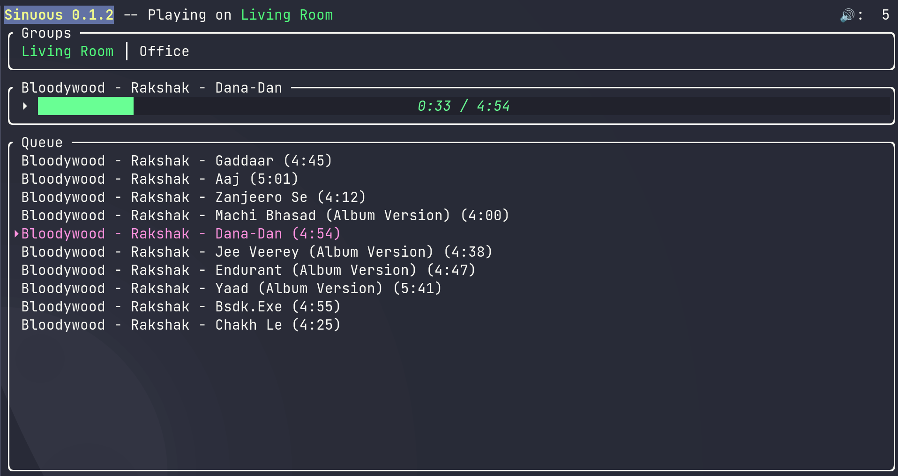

# Sinuous

Sinuous is a simple TUI for controlling local Sonos speakers.

It currently allows you to cycle through the different groups (zone players),
displays the current track, and the current queue.

Note: `sinuous` directly talks to the Sonos speakers via their local upnp
interface, and the speakers are discovered via the SSDP protocol. This means
your Sonos speakers need to be on the same network (or visible from your
current network).

## Key bindings

- <kbd>Space</kbd>: Play / Pause
- <kbd>p</kbd> / <kbd>n</kbd>: Skip to previous / next track
- <kbd>[</kbd> / <kbd>]</kbd>: Adjust volume of the coordinator of the current group
- <kbd>Shift+Tab</kbd> / <kbd>Tab</kbd>: Switch to previous / next group
- <kbd>q</kbd>: Quit

## To run

Install a recent Rust toolchain via [rustup](https://rustup.rs), if you don't
already have one, then simply run `cargo run`.

To get debug logs, run `RUST_LOG="sinuous=debug" cargo run`. The logs can be
found in `/tmp/sinuous.log`.

## Screenshot

## Todo

- [x] Allow switching between speakers
- [ ] Support more actions (seek forward, backward, change playing mode, volume...)
- [ ] Display play/pause indicator as well as current play mode (shuffle+repeat)
- [ ] Allow searching for tracks and modify the queue
- [ ] Allow customizing colours
- [x] Allow specifying speaker to connect to as a command line argument
- [ ] Handle grouping of speakers
